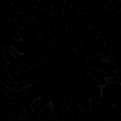

# Image Linear Filtering
Image linear filtering refers to performing operations over the neighborhood of a pixel with a special filter matrix called kernel or mask. The operations vary depending upon the type of kernel used. Image filtering is used to achieve noise reduction, blurring, edge detection, sharpening and so on in an image. There are various kinds of filters that assist to achieve particular image processing goals. Some of them are:
## Moving Average Filter:
Also called box filter, it is the most basic type of filter used to achieve blurring and hence, noise reduction in an image. The box filter is basically a (2n+1) x (2n + 1) {n = 0,1,2, ...} kernel matrix with all values 1. This filter is convolved throughout the image resulting an average pixel value of all the pixels corresponding to the positions in the kernel. The average thus obtained is stored in the center position of the submatrix corresponding to the kernel. Below is an example of a 3x3 box kernel:
```math
\begin{bmatrix}
1 & 1 & 1 \\
1 & 1 & 1 \\
1 & 1 & 1 \\
\end{bmatrix}
```
The result of applying box filter in an image is a blurred image having box-like distortions. Below is a comparision of a grayscale image with it's corresponding box filtered image obtained using 3x3 box kernel.

 

The above results are obtained using a 5x5 box Kernel.

## Gaussian filter
Gaussian filter is the type of image filter that follows gaussian distribution throughout it's values. Gaussian filter is also called **Fuzzy Filter**. It provides smoother results than box filter, avoiding the box-like distortions, as the center pixel is given the maximum weight and the farther pixels in the kernel are given decreasing weights. Due to this difference in weights, the effect of farther pixels on the target pixel is reduced and the weighted sum is achieved. This weighted sum is normalized to maintain the original brightness. Below is an example of 3x3 Gaussian Kernel.
```math
\begin{bmatrix}
1 & 2 & 1 \\
2 & 4 & 2 \\
1 & 2 & 1 \\
\end{bmatrix}
```
 

The above results are obtained using a 5x5 gaussian Kernel.
## Laplacian Kernel
The laplacian kernel is a type of kernel used to detect edges in an images, as well as sharpen the image by enhancing the detected edges. It uses the second derivative of an image to detect the change in intensity values throughout the image, rendering an edge map that can be useful for various purposes. It is to be noted that laplacian kernel often enhances the noise pixels too. Hence, laplacian kernel should be applied after or along with the gaussian kernel for better results. Below is an example of 3x3 Gaussian Kernel.
```math
\begin{bmatrix}
-1 & -1 & -1 \\
-1 & 8 & -1 \\
-1 & -1 & -1 \\
\end{bmatrix}
```
Here is an edge map generated from the gaussian blurred image generated using the laplacian operator which is added to the blurred image to obtain a sharpened image.

 +  = 

The laplacian kernel can also produce negative values which need to be scaled as per the valid range so that information doesn't get lost.

## Implementation with OpenCV and custom Matt class
The above generated results are achieved using the **Matt.convolve()** function specified in the custom Matt class. The function takes three arguements: Input matrix, output matrix, and the kernel. Here the kernel matrices are manualy passed according to the need of filters.
```c++
template <class T>
void Matt<T>::convolve(Matt& image, Matt& result, Matt<int>& kernel){
    int blocksize = kernel.rows;
    int normalizationFactor = kernel.sums();
    if(!normalizationFactor) normalizationFactor = 1;
    Matt<int> temp(image.rows, image.cols);
     for(int i = 0; i < image.rows; i++){
        for (int j = 0; j < image.cols; j++){
            int weightedSum = 0;
            for(int m = i - blocksize/2, k = 0; m <= i + blocksize/2 && k < kernel.rows; m++, k++){
                for(int n = j - blocksize/2, l = 0; n <= j + blocksize/2 && l < kernel.cols; n++, l++){
                    if (m < 0 || n < 0  || m >= image.rows || n >= image.cols) {
                        weightedSum += static_cast<int>(kernel.at(k,l) * 0);
                        continue;
                    }
                    weightedSum += kernel.at(k,l) * static_cast<int>(image.at(m,n));
                }
            }
            temp.at(i,j) = weightedSum / normalizationFactor;
        }
    }
    int min = temp.minim(); int max = temp.maxim();
   for(int i = 0; i < result.rows; i++){
        for(int j = 0; j < result.cols; j++){
                result.at(i,j) = (temp.at(i,j) - min) * 255.0 / (max - min);
        }
    }
}
```
The OpenCV library has built-in functions that perform the desired filter operations:
```c++
cv::Mat image = cv::imread(argv[1], cv::IMREAD_GRAYSCALE);
cv::Mat blurredImage;
    cv::GaussianBlur(image, blurredImage, cv::Size(11, 11), 0);
    cv::imwrite("openCV_blur.png", blurredImage);
    // Apply the Laplacian filter
    cv::Mat laplacianImage;
    cv::Laplacian(blurredImage, laplacianImage, CV_8U);
    cv::imwrite("openCV_laplacian.png", laplacianImage);

    // Perform image enhancement
    cv::Mat sharpenedImage = image - laplacianImage;
    cv::imwrite("openCV_sharp.png", sharpenedImage);
```

The outputs for above discussed filters implemented using OpenCV are:



