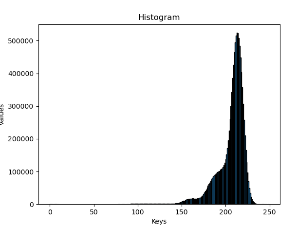
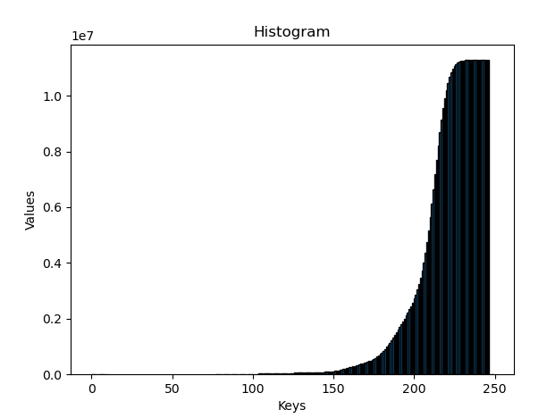
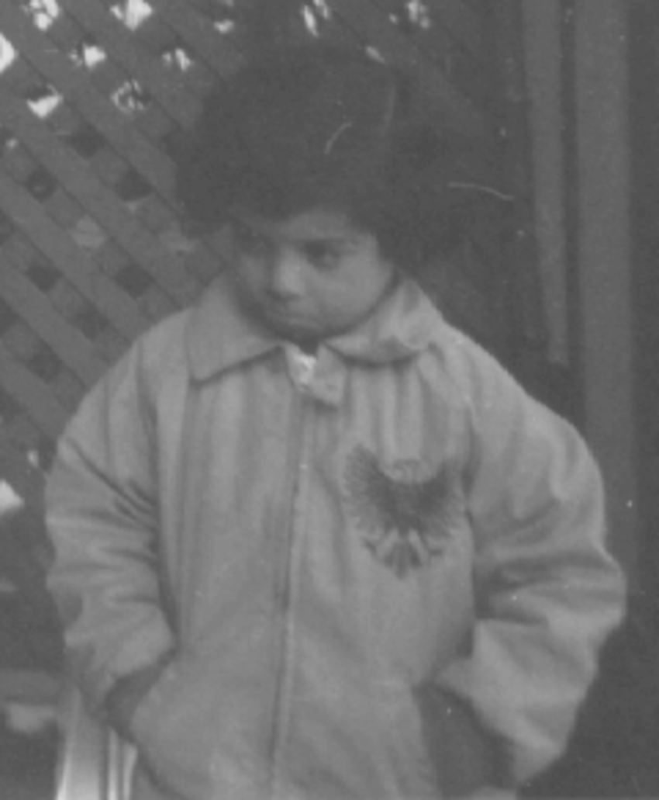
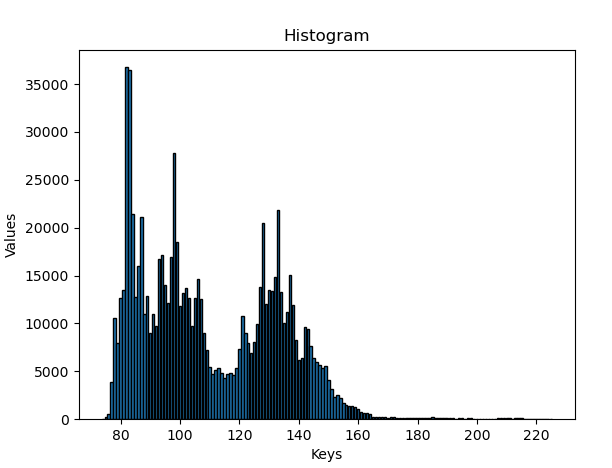
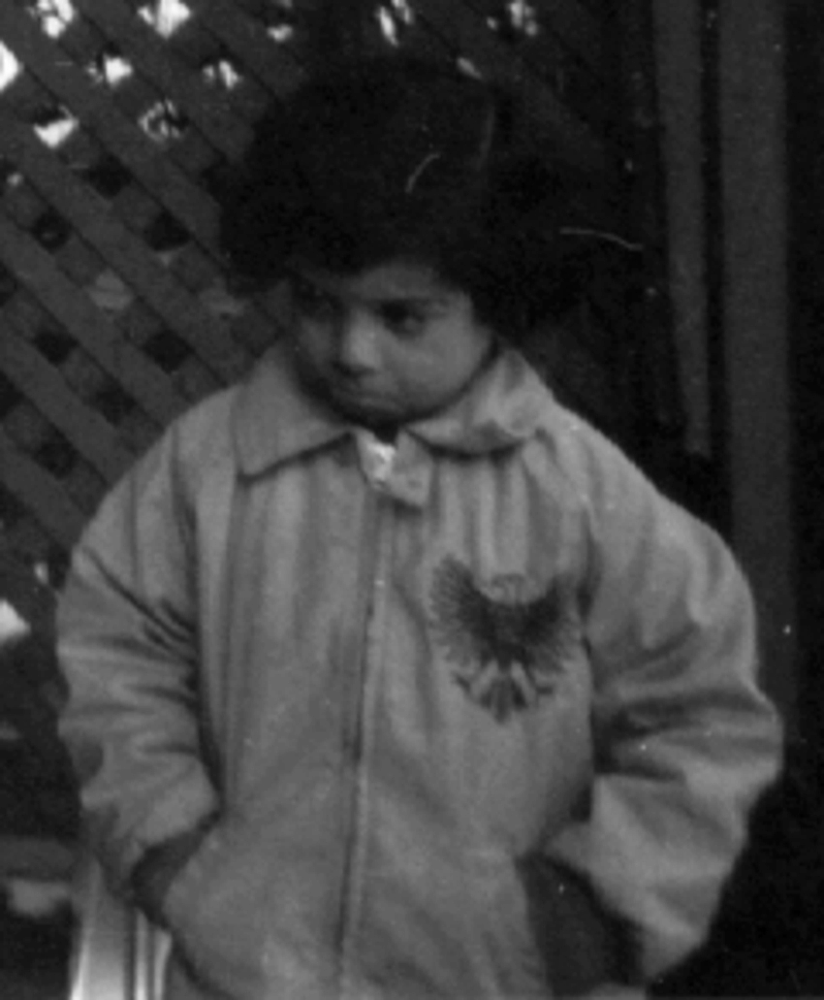
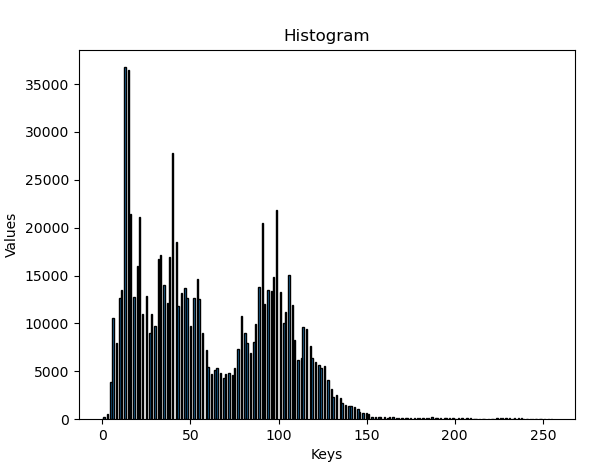

# Image Enhancement Techniques and Histograms

## **Histograms**
One of the basic steps in image processing is analysing the intensity levels of each pixel. Each image, be it grayscale or color has a wide range of intensity levels (typically 0 for least to 255 for highest intensity level). The plot representing number of pixels in an image corresponding to each or a range of intensity levels is called histogram of an image. For a grayscale image, there is only one histogram while in the case of colored images, there is one histogram for each color.

Example histogram of a dog image:


Here, the X-axis represents the intensity levels [0 to 255] and the Y-axis represents the number of pixels with that value of intensity.

#### **code snippet to achieve histogram:**
```c++
template <class T>
std::map<T, int> Matt<T>::createHist(Matt& image){
    std::map<T,int> hist;
    for(int i = 0; i < image.rows; i++){
        for(int j = 0; j < image.cols; j++){
            T intensity = image.at(i,j);
            hist[intensity]++;
        }
    }
    return hist;
}
```

## **Image Enhancement**
Image enhancement typically refers to improving the quality and visual appeal of an image by adjusting intensity, contrast, sharpness, noise, and other parameters. There are a lot of techniques for image enhancement.There are a few approaches that increase the contrast of an image by spreadinng or stretching the histogram plot across the entire intensity range. Two of them are: Histogram equalization approacha and Contrast stretching approach.
### **Contrast stretching approach**
This is one of the image enhancement techniques that distributes the number of pixels skewed towards a particular range of intensities to the largest possible range of intensities through normalization. The maximum and minimum intensities between which the histogram is skewed are figured out and each pixel itensity inside that range is normalised to fit between maximum and minimum possible intensity i.e. 0 to 255

The general formula for normalizing each pixel based on the current maximum and minimum intensity present in the image is:

$$ newIntensity = {(currentIntensity - min)\\\over (max - min)} * (maxPossibleIntensity - minPossibleIntensity) + minPossibleIntensity $$

Where, max and min are the maximum and minimum values in the skewed range.

```c++
template <class T>
void Matt<T>::contrastStretch(std::map<T, int>& hist, Matt& image){
    T min, max;
    for(const auto& i: hist){
        if (i.second == 0) {
            continue;
        }
        min = i.first;
        break;
    }
    typename std::map<T, int>::reverse_iterator it;
    for(it = hist.rbegin(); it != hist.rend(); ++it){
        if(it->second == 0) continue;
        max = it->first;
        break;
    }
    std::cout<<"\n "<<static_cast<int>(max)<<"\t"<<static_cast<int>(min);

    for(int i = 0; i < image.rows; i++){
        for(int j = 0; j < image.cols; j++){
            image.at(i,j) = static_cast<T>(255 * (image.at(i,j) - min)/static_cast<float>(max - min));
        }
    }

    hist = Matt<T>::createHist(image);
    
}

```
### **Histogram equalization approach**
The histogram of an image represents the frequency of occurrence of each pixel intensity value. In histogram equalization, the original histogram is transformed to create a new histogram that has a more uniform distribution. This transformation is achieved by stretching the intensity values across the full range of intensities. The concept of **Cumulative Probability Distribution Function (CDF)** is utilized in order to figure out the corresponding pixel intensity to replace the original pixel intensity with. It includes four major steps:
1. Compute the histogram of the input image.
2. Calculate the cumulative distribution function (CDF) from the histogram.
3. Normalize the CDF to map it to the full intensity range.
4. Apply the normalized CDF as a lookup table to transform the original image intensities.
```c++
template <class T>
void Matt<T>::histEqualize(std::map<T,int>& hist, Matt& image){
    
    std::map<T, T> newVals;
    for(auto& pair: hist){
        if(pair.first == 0) {
            newVals[pair.first] = static_cast<T>(round(pair.second/static_cast<double>(image.rows * image.cols)));
            continue;
            }
        pair.second += hist[pair.first - 1];
        newVals[pair.first] = static_cast<T>(round(255 * pair.second/static_cast<double>(image.rows * image.cols)));
    }

   
    for(int i = 0; i < image.rows; i++){
        for(int j = 0; j < image.cols; j++){
            image.at(i,j) = static_cast<unsigned char>(newVals[image.at(i,j)]);
        }
    }
}
```
### **Results with histogram equalization**
#### **Input:**



#### **Output:**



### **Results with Contrast Stretching**
#### **Input:**



#### **Output:**

