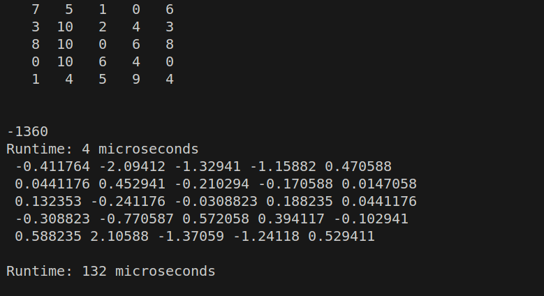
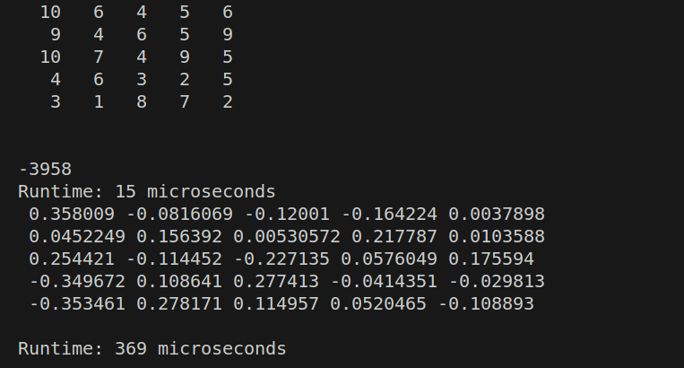
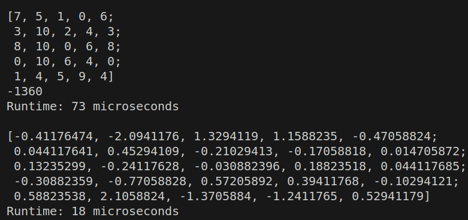
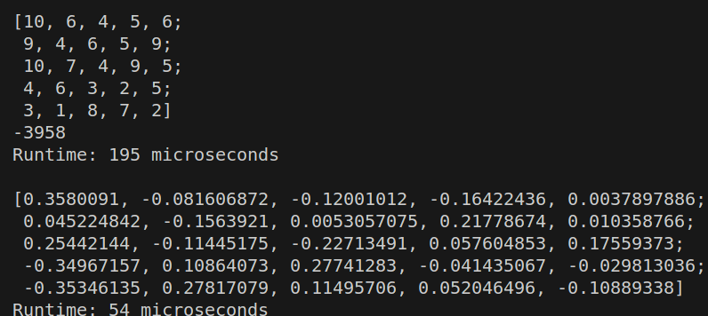

# Determinants and Inverse: Issue 20
This task was focused on calculating the **determinant** and **inverse** of any square matrix.
## Determinants
The determinant is a scalar value that is a function of the entries of a square matrix. It characterizes some properties of the matrix and the linear map represented by the matrix. There are a number of possible approaches to calculate determinant of a given matrix. Some of them are discussed below:
### Recursive Approach
This approach can be considered as the brute force approach to calculate the determinant of a matrix. In order to accomplish the goal using this method, one should first create co-factor matrix of each element in the first row. The determinant of this co-factor matrix is multiplied with the element at the first position of first row. the process is subjected to recursion until the control reaches (n-2) th row. For the element at [(n-2), (n-2)] position, the cofactor matrix is a 2x2 matrix whose determinant can be calculated relatively easily.

### LU Decomposition Approach
This is the approach I chose in this issue. It involves reducing the given matrix into an upper triangular matrix. An upper triangular matrix is a matrix where all the elements below the leading diagonal are zero. The conversion of a regular matrix into an upper triangular matrix is achieved by using **row-equivalent arithmetic**. I tried to implement row-equivalent operations of the elements of the matrix through nested loops.

The logic behind this approach is:
* The determinant of a square matrix remains unchanged if operations on rows or columns are added or subtracted with the elements of other rows or columns multiplied by a certain factor.
* The product of elements in the leading diagonal of an upper triangular matrix gives the magnitude of determinant of the matrix.

It is to be considered that while converting a regular matrix into it's upper triangular counterpart, we must ensure that the elements in the leading diagonal are non-zero. If we find a zero value in any of the diagonal elements, we simply swap that column with another column. This changes the sign of the determinant but the magnitude remains the same.

Furthermore, if all the elements in a row are zero, the determinant of the matrix automatically becomes zero. 
### Code Snippets
```c++
Matt Matt::triangularU(){
    Matt temp; bool success = true;
    this->copyTo(temp);
    for (int i = 0; i < temp.rows; i++){
        if(temp.at(i,i) == 0) success = temp.swapCols(i);
        if(!success){
            delete temp.matData;
            *(temp.refcount)--;
            break;
        }
            for(int j = i + 1; j < temp.rows; j++){
                float factor = static_cast<float>(temp.at(j,i))/static_cast<float>(temp.at(i,i));
                for(int k = i; k < temp.cols; k++){
                    temp.at(j,k) -= factor*temp.at(i,k);
                }
            }
    }
    return temp;
}

bool Matt::swapCols(int i){
    int colIndex = -1;
    for (int j = i + 1; j < this->cols; j++){
        if(this->at(i,j) !=0){
            colIndex = j;
            break;
        }
    }
    if(colIndex == -1) return false;
    for (int k = 0; k < this->rows; k++){
        std::swap(this->at(k,i), this->at(k,colIndex));
    }
    return true;
}

double Matt::determinant(){
    double result = 1;
    Matt temp = this->triangularU();
    if(!temp.matData) return 0;
    for (int i = 0; i < temp.rows; i++){
        result *= temp.at(i,i);
    }
    return result;
}
```
There are three major functions involved in calculating the determinant of the given matrix.

First, the determinant() function calls the function to convert the given object matrix into upper triangular matrix using **triangularU()** function. The triangularU() function applies row equivalent calculations until it encounters a **0** value in the leading diagonal. If this occurs, the columns need to be swapped. So, **swapCols()** comes into action. if the column swap is not successful, i.e. all elements in that row are found to be zero, the determinant of the matrix is automatically zero.
## Inverse of a matrix
The inverse of a matrix is simply a square matrix, which when multiplied with the original matrix, gives an identity matrix. There are a number of ways to calculate the inverse of a matrix.
### Adjoint of Matrix
To learn about Adjoint of a square matrix, we need to clear out the concepts of **minor** and **cofactor**. Minor of a **(nxn)** matrix is the matrix where all the elements are replaced by the determinants of **(n-1 x n-1)** matrices obtained by skipping the row and column of the current element. In simpler terms, the minor of A<sub>ij</sub> (nxn matrix) is the determinant of (n-1 x n-1) matrix obtained by skipping the i<sup>th</sup> row and j<sup>th</sup> column in the matrix A.

The matrix of the minors of each elements of the matrix A can be converted into the **co-factor** matrix of A by simply multiplying each element with their respective signs. (Sign of A<sub>ij</sub> is (-1)<sup>i + j</sup>).

Finally, **Adjoint** of matrix A can be obtained by transposing the co-factor matrix.
Once we have the adjoint of matrix A i.e Adj. A, the inverse can be calculated as follows:

$$I = \frac{1}{\left|A\right|} \cdot \text{Adj}(A)$$
This approach was used to find the inverse of a given matrix.
### Code Snippets
```c++
Matt Matt::inverse(){
    Matt temp;
    if (this->rows != this->cols){
        std::cout<<"\nNot invertible!!!\n";
        return temp;
    }
    double det = this->determinant();
    if(!det) return temp;
    this->copyTo(temp);
    Matt minor(temp.rows - 1);

    for(int i = 0; i < temp.rows; i++){
        for(int j = 0; j < temp.cols; j++){
            this->setMinor(minor, i,j);
            temp.at(i,j) = pow((-1), (i+j)) * minor.determinant();
        }
    }
    temp.transpose();
    temp = temp / det;
    return temp;
}
void Matt::setMinor(Matt& child, int r, int c){
    int minorRow = 0, minorCol = 0;

    for (int i = 0; i < this->rows; i++){
        if(i == r) continue;
        for (int j = 0; j < this->cols; j++){
            if (j == c) continue;
            child.at(minorRow, minorCol) = this->at(i,j);
            minorCol++;
        }
        minorRow++;
        minorCol = 0;
    }

}

void Matt::transpose(){
    for(int i = 0; i < this->rows; i++){
        for(int j = i + 1; j < this->cols; j++){
           std::swap(this->at(i,j), this->at(j,i)) ;
        }
    }
}

Matt& Matt::operator/(double det){
    for(int i = 0; i < this->rows; i++){
        for(int j = 0; j < this->cols; j++){
            this->at(i,j) = static_cast<float>(this->at(i,j)/det);
        }
    }
    return *(this);
}
```
The setMinor() function inside the inverse() function is used to specify a **(n-1 x n-1)** minor for each element in the **(n x n)** matrix. the minors are multiplied with the signs associated with matrix positions to get the co-factor matrix. 

## Use of cv::Mat class
In OpenCV cv::Mat class, the determinants of matrices are calculated using **cv::determinant(matrix)** function. It utilizes LU decomposition method and the time complexity is O(n^3). 

Similarly, the inverse of a matrix is calculated using **cv::invert(originalMatrix, inverseMatrix)** function that uses **Gauss Jordan Apprach** with time complexity O(n^3).

### Test cases
In the provided codebase, the custom Matt function and `cv::Mat` class functions provide identical outputs.
The runtimes are mentioned in the followinf screenshots. Runtimes vary according to the size of matrices.

Using Custom Matt class:





Using cv::Mat Class:



